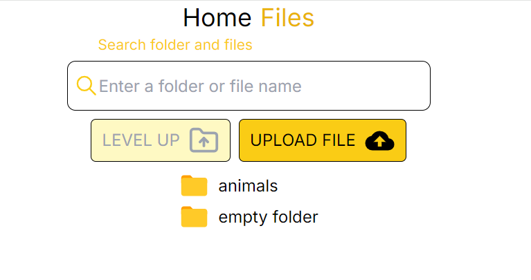

# FILE EXPLORER 💻🧩👨🏿‍💻

**[View live page](https://iridescent-capybara-a66fa8.netlify.app/)**

---



## 🗂️ Project description 🗂️

A Next.js web application - File explorer

- **Project name**: File explorer

### Functional

- **Synchronization with Dropbox account**: All information about folders and files is taken from the Dropbox service.
- **Search files**: The ability to search for files and folders has been implemented. When entering the name of folders or files in the input, only those files and folders whose name matches the entered data are displayed on the screen (register and spaces at the beginning and end of the entered data are not taken into account).
- **Modularity and reusability**: The product is built using a component
  approach, which makes the code modular and allows components to be used on
  different pages and in different sections of the project. This simplifies the
  maintenance of the site and the expansion of its functionality.
- **Moving through folders**:
  The ability to view the contents of folders and navigate between them has been implemented.

<details>

<summary><b>Project Organization and File Collocation: </b></summary>

<br/>

```

|-- public -> static files
|-- src -> source directory with the main application code
  |-- app -> pages and routing
  |-- components -> folder with components
    |-- base -> base sections/block components
    |-- ui -> small reusable components
  |-- layout -> components that are used as a main template (header, footer)
  |-- sections -> folder with section components
  |-- data -> static data for the project (json)
  |-- types -> folder with reusable type definitions
  |-- utils -> additional reusable functions

```

</details>

### Components API

This is a list of reusable components and their API.

- #### Button

The reusable Button component

| Prop         | Default | Description                                                         |
| ------------ | ------- | ------------------------------------------------------------------- |
| `children`   | -       | required, `React.ReactNode`, the content of the button.             |
| `type`       | -       | optional, `button` or`submit` or `reset`, the type of the button.   |
| `className`  | -       | optional, `string`, adds custom or additional css class you'd need. |
| `otherProps` | -       | optional, `any`, other props can be provided.                       |

- #### File

The File component

| Prop           | Default | Description                                                      |
| -------------- | ------- | ---------------------------------------------------------------- |
| `name`         | -       | required, `string`, the name of the folder or file.              |
| `id`           | -       | required, `string`, the unique identifier of the file or folder. |
| `.tag`         | -       | required, `string`, the type of the data (file or folder).       |
| `path_display` | -       | required, `string`, the path to the file or folder.              |

- #### TextField

The reusable TextField component

| Prop             | Default | Description                                                                     |
| ---------------- | ------- | ------------------------------------------------------------------------------- |
| `label`          | -       | optional, `string`, the label of the input.                                     |
| `inputClassName` | ''      | optional, `string`, adds the custom css class on the input                      |
| `labelClassName` | ''      | optional, `string`, adds the custom css class on the input                      |
| `onChange`       | ''      | optional, `(e: ChangeEvent<HTMLInputElement>) => void`, onChange input function |
| `value`          | ''      | optional, `string`, the value prop on the input                                 |

</details>

### 🚧 Technology stack

- **Main technologies**:

  - Next.js (app router)
  - TypeScript
  - Tailwind CSS

- **Additional dependencies**:

  - Dropbox
  - Swiper
  - React-icons
  - Clsx
  - React-toastify

  ...full list of dependencies is available in `package.json` file.

## 🗃️ How to run the project in development 🗃️

To run this project you need to follow these steps:

1. **Clone the repository**: Use the `git clone` command to clone this
   repository to your computer.
2. **Install the dependencies**: Open a terminal in the root of the project and
   run `npm install` or `yarn install` to install all required dependencies.
3. **Setting environment variables**: Create a `.env.local` file in the root folder
   and add the necessary environment variables that you need for the project
   according to the `.env.example` file.
4. **Run the application**: Run the `npm run dev` or `yarn dev` command to run
   the project on the local server.
